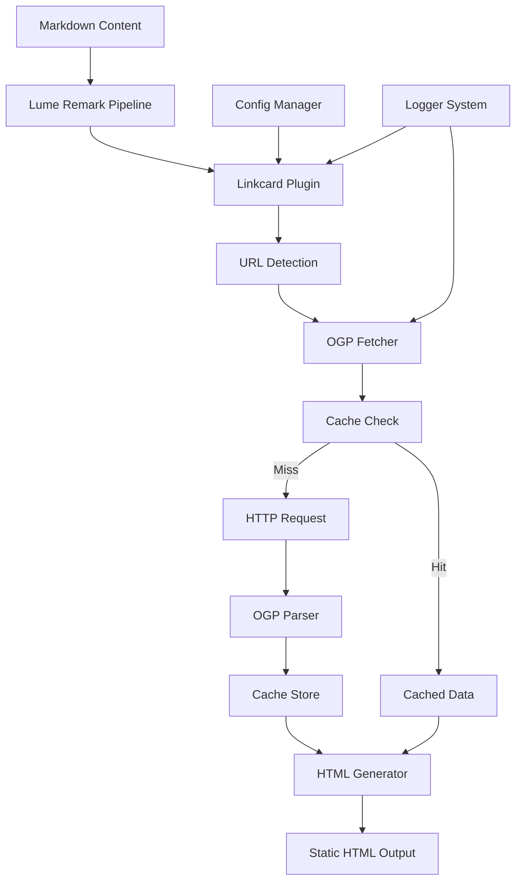
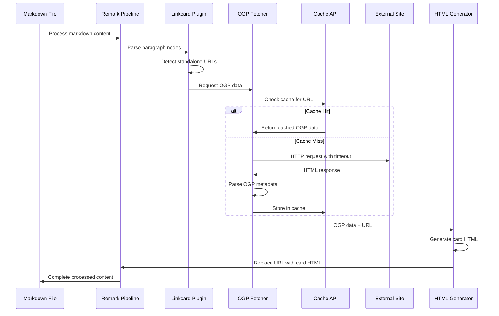
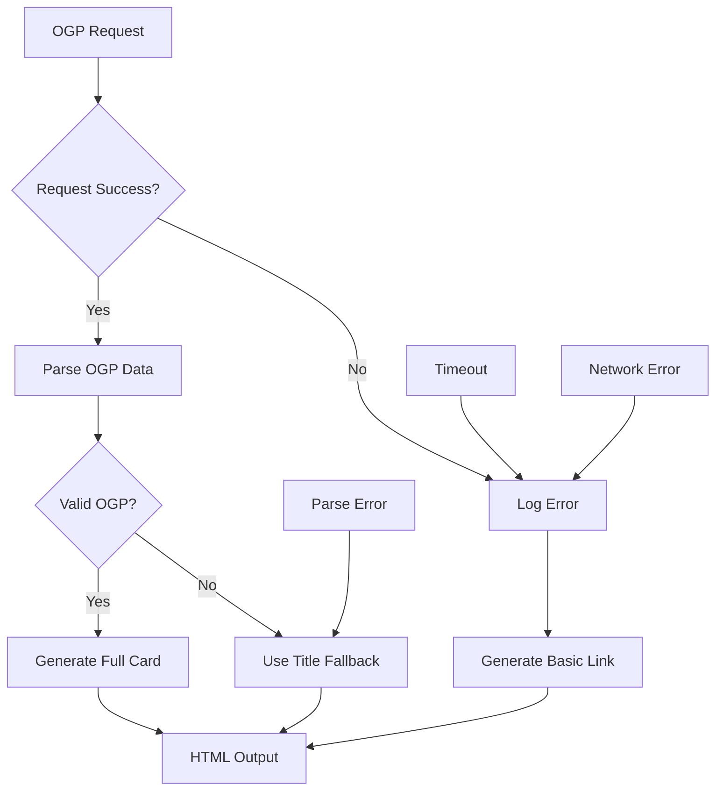
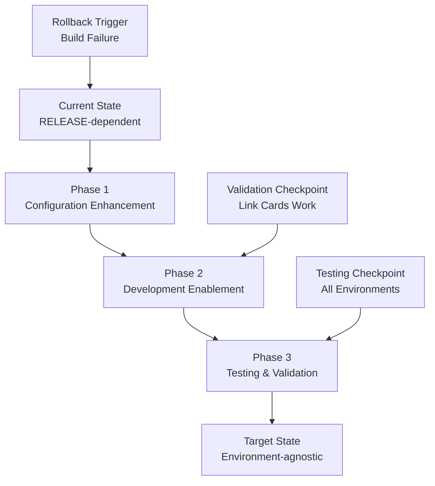

# テクニカルデザイン文書

## 概要

この機能は、現在本番環境のみで有効化されているリンクカード機能を開発環境でも動作するように修正し、開発者およびサイト利用者のユーザー体験を向上させる。現在、リンクカードプラグインは`RELEASE`環境変数の存在時のみ有効化されているため、開発環境では外部リンクが通常のテキストリンクとして表示されている。

**目的**:
開発環境と本番環境でのリンクカード表示の一貫性を保ち、全環境で適切なOGPデータ取得とリンクプレビュー機能を提供する。

**ユーザー**:
開発者は開発環境での作業時にリンクカードプレビューを確認でき、サイト訪問者は魅力的なリンクプレビューを通じてコンテンツを素早く理解できる。

**影響**:
現在の設定依存による条件付き機能有効化を、より柔軟な環境ベース設定に変更し、開発体験とコンテンツ品質を向上させる。

### ゴール

- 開発環境でのリンクカード機能の有効化
- 環境に関係なく一貫したOGPデータ取得と表示
- エラーハンドリングとデバッグ機能の強化
- ビルドプロセスの安定性維持

### 対象外

- リンクカードの視覚的デザインの大幅な変更
- 新しいサードパーティライブラリの導入
- OGPデータキャッシュアルゴリズムの根本的な変更
- マークダウン処理以外のコンテンツタイプのサポート

## アーキテクチャ

### 既存アーキテクチャ分析

現在のリンクカードシステムは以下の構成要素で構築されている：

- **Lume Remark プラグインチェーン**:
  マークダウン処理パイプライン内でリンクカードを生成
- **既存ドメイン境界**:
  プラグイン層（`plugins/linkcard.ts`）とユーティリティ層（`utils/fetchogp.ts`）の明確な分離
- **維持すべき統合ポイント**:
  `_config.ts`での設定管理、既存のログシステム、キャッシュAPIの使用
- **対処する技術的負債**:
  環境変数による硬直的な機能切り替えを、より柔軟な設定ベースアプローチに改善

### 高レベルアーキテクチャ



### 技術適合性

**既存技術スタック準拠**:

- Lume v3プラグインアーキテクチャパターンの保持
- Deno標準ライブラリとキャッシュAPIの継続使用
- TypeScript型安全性の完全な維持
- TailwindCSS/DaisyUIスタイリングシステムとの互換性

**新規依存関係**: なし - 既存のコンポーネントの設定変更のみ

**パターンからの逸脱**: なし - 既存の設定管理とプラグイン登録パターンに従う

## システムフロー

### リンクカード生成フロー



### エラーフロー



## 要件トレーサビリティ

- **1.1-1.4**: `_config.ts`の設定管理とプラグイン登録による実現
- **2.1-2.5**: `utils/fetchogp.ts`のOGPデータ取得とパース機能
- **3.1-3.5**: `plugins/linkcard.ts`のHTML生成とTailwind CSSスタイリング
- **4.1-4.4**: Cache APIとPromise.all並列処理による実装
- **5.1-5.4**: `utils/logger.ts`ログシステムと例外ハンドリング
- **6.1-6.4**: 環境変数ベース設定管理システム

## コンポーネントとインターフェース

### 設定管理層

#### ConfigurationManager

**責任と境界**

- **主要責任**: 環境変数とビルド設定に基づくリンクカード機能の制御
- **ドメイン境界**: ビルド設定とプラグイン構成管理
- **データ所有権**: プラグイン有効化フラグと環境固有設定
- **トランザクション境界**: ビルド時の単一設定適用

**依存関係**

- **Inbound**: `_config.ts` Lume設定
- **Outbound**: 環境変数、`plugins/linkcard.ts`
- **External**: Deno環境変数API

**サービスインターフェース**

```typescript
interface LinkCardConfig {
  enabled: boolean;
  developmentMode: boolean;
  cachingEnabled: boolean;
  timeoutMs: number;
}

interface ConfigurationService {
  getLinkCardConfig(): LinkCardConfig;
  isLinkCardEnabled(environment: Environment): boolean;
  getEnvironmentConfig(): EnvironmentConfig;
}
```

**前提条件**: 有効な環境変数が設定されていること **事後条件**:
環境に応じた適切なプラグイン設定が提供される **不変条件**:
設定変更はビルド再実行時のみ反映される

**統合戦略**:

- **変更アプローチ**: 既存の`_config.ts`設定パターンを拡張
- **後方互換性**: `RELEASE`環境変数のサポート維持
- **移行パス**: 段階的な設定システム強化

### マークダウン処理層

#### LinkCardPlugin

**責任と境界**

- **主要責任**: マークダウン内のスタンドアロンURLを検出しリンクカードHTMLに変換
- **ドメイン境界**: コンテンツ変換とマークアップ生成
- **データ所有権**: URL検出ロジックとHTML生成テンプレート
- **トランザクション境界**: 単一マークダウンファイルの処理

**依存関係**

- **Inbound**: Lume Remarkプラグインチェーン
- **Outbound**: OGPFetcher, HTMLGenerator
- **External**: `unist-util-visit` ASTユーティリティ

**バッチ/ジョブ契約**:

- **トリガー**: マークダウンファイル処理時の自動実行
- **入力**: ASTノード構造とURL検出パターン
- **出力**: 変換されたHTMLノードまたは元のテキストノード
- **冪等性**: 同一入力に対する一貫した出力保証
- **復旧戦略**: 変換失敗時の元のURLテキスト保持

#### OGPFetcher

**責任と境界**

- **主要責任**: 外部URLからOGPメタデータを取得しキャッシュ管理を行う
- **ドメイン境界**: 外部データ取得と一時ストレージ管理
- **データ所有権**: OGPメタデータとHTTPリクエスト結果
- **トランザクション境界**: 単一URL単位でのデータ取得と保存

**依存関係**

- **Inbound**: LinkCardPlugin
- **Outbound**: Cache API, HTTP Fetch API, DOMParser
- **External**: 外部ウェブサイト、`@b-fuze/deno-dom`、`valibot`

**サービスインターフェース**

```typescript
interface OGPData {
  url?: string;
  siteTitle: string;
  title?: string;
  image?: string;
  name?: string;
}

interface OGPFetchService {
  fetchOGInfo(url: string, timeout?: number): Promise<OGPData>;
  clearCache(url?: string): Promise<void>;
  getCacheStatus(): Promise<CacheStats>;
}

type FetchResult = {
  success: true;
  data: OGPData;
} | {
  success: false;
  error: FetchError;
  fallbackData: Partial<OGPData>;
};
```

**前提条件**: 有効なHTTP(S) URLと10秒以内のタイムアウト **事後条件**:
正常時は完全なOGPData、エラー時は最小限のフォールバックデータを返却
**不変条件**: キャッシュデータの整合性とタイムアウト制限の遵守

**状態管理**:

- **状態モデル**: Idle → Fetching → Cached/Failed のサイクル
- **永続化**: Cache APIによるブラウザキャッシュ使用
- **同期制御**: 同一URL同時リクエストの重複排除

## データモデル

### OGPデータモデル

**構造定義**:

```typescript
interface OGPInfo {
  url?: string; // og:url または要求元URL
  siteTitle: string; // HTMLタイトルタグ（必須フォールバック）
  title?: string; // og:title（オプション）
  image?: string; // og:image 絶対URL（オプション）
  name?: string; // og:site_name（オプション）
}

interface CacheEntry {
  data: OGPInfo;
  timestamp: number;
  expiry: number;
}

interface FetchError {
  type: "network" | "timeout" | "parse" | "validation";
  message: string;
  url: string;
  timestamp: number;
}
```

**整合性とインテグリティ**:

- **トランザクション境界**: 単一URL単位でのアトミックな取得と保存
- **参照整合性**: 画像URLの絶対パス変換保証
- **時間的側面**: キャッシュエントリの有効期限管理

### データ契約と統合

**イベントスキーマ**:

- **公開イベント**: なし（静的サイト生成のため）
- **スキーマバージョニング**: TypeScript型定義による静的検証
- **後方/前方互換性**: valibot スキーマによる実行時検証

## エラーハンドリング

### エラー戦略

リンクカード生成プロセスでは、エラーが発生してもサイト全体の生成を停止せず、適切なフォールバック表示を提供する。

### エラーカテゴリと対応

**ネットワークエラー（5xx系）**:

- タイムアウト → 基本リンク表示 + ログ記録
- 接続失敗 → ドメイン名のみの表示
- HTTPステータスエラー → エラー詳細のログ出力

**データパースエラー（4xx系）**:

- 無効なHTML → タイトルタグフォールバック
- OGPタグ不在 → サイトタイトル使用
- 画像URL無効 → テキストのみ表示

**ビジネスロジックエラー**:

- URL形式不正 → 元のテキストリンク保持
- キャッシュエラー → リアルタイム取得に切り替え

### 監視

- エラー追跡: `utils/logger.ts` による構造化ログ出力
- ログ記録: ファイルベースログとコンソール出力の使い分け
- ヘルスモニタリング: ビルド成功率とエラー発生率の記録

## テストストラテジー

### ユニットテスト

- **OGPデータパース機能**: 各種OGPタグの正確な抽出
- **URL検出ロジック**: マークダウン内URLパターンマッチング
- **HTML生成関数**: カードレイアウトとスタイリング適用
- **エラーハンドリング**: タイムアウトと例外処理の動作
- **キャッシュ操作**: データ保存と取得の正確性

### 統合テスト

- **プラグイン統合**: Lume処理パイプライン内でのプラグイン動作
- **環境設定連携**: 開発/本番環境での設定切り替え
- **外部サイト連携**: 実サイトからのOGPデータ取得（モック使用）
- **キャッシュシステム**: Cache APIとの統合動作
- **ログシステム連携**: エラー発生時のログ出力確認

### E2E/UIテスト

- **リンクカード表示**: ブログ記事内でのカード正常表示
- **レスポンシブ対応**: モバイル/デスクトップでのレイアウト
- **クリック動作**: カードクリック時の適切なナビゲーション
- **エラー時表示**: 取得失敗時のフォールバック表示
- **開発環境での動作**: `deno task serve` 実行時の機能確認

### パフォーマンステスト

- **並列OGP取得**: 複数URLの同時処理効率
- **キャッシュ効果**: 同一URL再取得時の応答時間
- **ビルド時間**: リンクカード処理によるビルド時間への影響
- **メモリ使用量**: 大量URL処理時のリソース使用量

## マイグレーション戦略



**プロセス**:

**フェーズ 1: 設定強化（1-2時間）**

- `_config.ts`でのリンクカード設定ロジック修正
- 環境変数ベース制御の実装
- ロールバックトリガー: ビルドエラーまたは型チェック失敗

**フェーズ 2: 開発環境有効化（1時間）**

- 開発環境でのプラグイン有効化
- ログレベル調整とデバッグ情報追加
- 検証チェックポイント: リンクカード表示確認

**フェーズ 3: テストと検証（2-3時間）**

- 全環境での動作確認
- パフォーマンステストの実行
- テストチェックポイント: 既存機能の無害性確認
