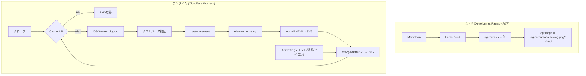
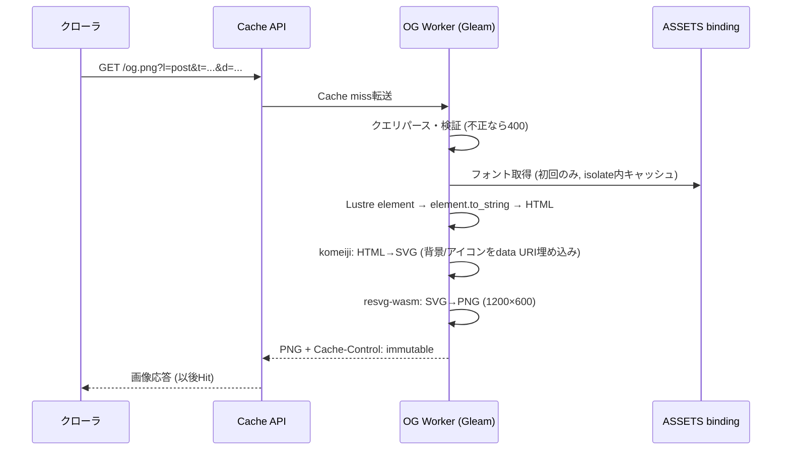

# テクニカルデザイン文書

## 概要

本機能は、Lumeビルド時にsatoriで生成しているOGP画像を、Cloudflare Workers
(Gleam実装) によるリクエスト時動的生成に移行する。

**目的**: ビルド時間のネック (satori実行 + Noto Sans CJK JP フルOTF
~16MB×2の読み込み) を 解消し、OG画像の描画をビルドプロセスから分離する。

**ユーザー**: SNSクローラは記事ごとのOG画像を`og.comamoca.dev`から取得する。
サイト管理者はWorkerとサイトを独立してデプロイできる。

**影響**:
`_config.ts`からOG画像生成を撤去し、新規に`og/`ディレクトリへGleam製Workerを追加。
og:imageのURLは従来の`/blog/<slug>/index.png`から`https://og.comamoca.dev/og.png?...`へ変わる。

### ゴール

- ビルドからのOG画像生成撤去によるビルド高速化
- 描画コードの単一化 (satori/TSXを廃止しkomeiji/Gleamに統一)
- ステートレスなWorkerによる独立デプロイ
- コンテンツアドレス型URLによるpurge不要のキャッシュ

### 対象外

- OG画像のデザイン変更 (現行のpostOgImage/mainOgImageデザインを移植)
- 記事本文のレンダリング・linkcard機能への変更
- `v1/posts.json` のようなメタデータAPI (Workerはデータを持たないため)
- 旧URL (`/blog/<slug>/index.png`) のリダイレクト
  (SNSキャッシュの自然失効に任せる)

## アーキテクチャ

### 既存アーキテクチャ分析

現行のOG画像生成は以下の構成:

- **Lume og_imagesプラグイン** (`_config.ts:108-142`, RELEASE時のみ): satori
  0.18.3 (JSX→SVG) → sharp 0.34.5 (内部でresvg-wasm 2.6.2, SVG→PNG)
- **出力**: HTMLと同じパスの`.png` (例: `/blog/2024-09-15-diary/index.png`)
- **og:image出力経路**: og_imagesプラグインが`data.metas.image`に相対パスを設定
  → metasプラグインが絶対URL化
- **入力データ**: 記事は`title` + `description` (80字で切り詰め) のみ
- **フォント**: `./fonts/noto-fonts/`のNoto Sans CJK JP フルOTF (Regular/Bold,
  サブセットなし)
- **背景**: `gakumas-sozai.png` (445KB) をbase64 data URIで埋め込み
- **既知バグ**: `mainOgImage.tsx`が未登録の`NotoSansJPBlack`を指定
  (移行時に解消)

### 高レベルアーキテクチャ



### 技術適合性

**新規依存** (すべて`og/`配下のGleamプロジェクトに閉じる):

| パッケージ        | 取得方法                 | 役割                                                               |
| ----------------- | ------------------------ | ------------------------------------------------------------------ |
| comamoca/hinoto   | git依存 (hex未公開)      | Workersランタイム (`hinoto/runtime/workers`)                       |
| lustre            | hex                      | OGカードのelement定義・SSR (`element.to_string`, JSターゲット対応) |
| comamoca/komeiji  | git依存 (作成中・未公開) | HTML→SVG変換                                                       |
| @resvg/resvg-wasm | npm (shim経由)           | SVG→PNG (静的WASM import)                                          |

**Lume側の新規依存**: なし (標準API + WebCryptoのみ)

## システムフロー



## コンポーネント設計

### URL仕様

```
https://og.comamoca.dev/og.png?l=<post|main>&t=<title>&d=<description>
```

| パラメータ | 必須 | 内容                                                  |
| ---------- | ---- | ----------------------------------------------------- |
| `l`        | ○    | `post` (記事カード) / `main` (サイト名カード)         |
| `t`        | ○    | タイトル (URLエンコード)                              |
| `d`        | ×    | 説明文。80字+「…」に切り詰め済み (Lumeフック側で実施) |

- **署名なし** (ユーザー決定):
  任意文字列での画像生成が可能だが、個人ブログとして許容。
  将来HMACを追加する場合も後方互換で対応可能 (design決定ログ参照)
- URLはコンテンツに決定的 → 同一コンテンツは同一URL → キャッシュキーとして機能。
  版管理パラメータ (`v=<hash>`) は不要 (コンテンツ変更が直接URL変更になるため)
- URL長:
  日本語80字説明文を含む最悪ケースで~1.5KB。主要クローラは実績上問題なし。
  デプロイ後にCard Validatorで実機確認する

### Worker (`og/` Gleamプロジェクト)

```
og/
├── gleam.toml              # hinoto, lustre, komeiji (git), gleam_http, gleam_stdlib
├── wrangler.toml
├── static/                 # ASSETS binding (フォント/背景/アイコン)
└── src/
    ├── og_worker.gleam     # main(): workers.serve(router)
    ├── og_worker/router.gleam      # /og.png ルート・バリデーション (400/500)
    ├── og_worker/card.gleam        # Lustre element (post/main)
    ├── og_worker/render.gleam      # to_string → komeiji → resvg のパイプライン
    ├── og_worker/fonts.gleam       # ASSETS読み込み + isolateキャッシュ
    └── og_worker/interop/resvg.mjs # JS shim
```

- エントリはhinotoの `hinoto/runtime/workers` で `workers.serve(router)`
- パラメータ解析は `gleam_stdlib` の `gleam/uri` (`uri.parse_query`) を使用
- エラー応答: 必須パラメータ欠落/不正 → 400、レンダリング失敗 → 500 (ログ記録)

### 描画パイプライン

1. **Lustre element**: 旧`postOgImage.tsx`
   (白カード+タイトル55px+説明文32px+フッター: アイコン/Comamoca/サイト名)
   と`mainOgImage.tsx` (サイト名80px) を移植。
   フォントは`NotoSansJP Black`を正しく登録して旧バグを解消
2. **HTML化**: `lustre/element`の`to_string` (純Gleam、JSターゲット対応)
3. **komeiji**: HTML → SVG。契約:
   `HTML文字列 + フォントバッファ + 画像data URI → SVG文字列`。
   文字折り返し・CJK改行はkomeijiの責務 (resvgはlayoutしない)
4. **resvg-wasm**: 静的import必須 (Workersは動的WASMコンパイルを禁止)。

```javascript
// og/src/og_worker/interop/resvg.mjs
import resvgWasm from "@resvg/resvg-wasm/index_bg.wasm";
import { initWasm, Resvg } from "@resvg/resvg-wasm";

let inited = false;
export async function ensureInit() {
  if (!inited) {
    await initWasm(resvgWasm);
    inited = true;
  }
}
export function renderPng(svg, fontBuffers, width) {
  const r = new Resvg(svg, {
    fitTo: { mode: "width", value: width },
    font: { fontBuffers },
  });
  return r.render().asPng();
}
```

```gleam
// og/src/og_worker/render.gleam
@external(javascript, "./interop/resvg.mjs", "ensureInit")
fn ensure_init() -> Promise(Nil)

@external(javascript, "./interop/resvg.mjs", "renderPng")
fn render_png(svg: String, fonts: List(BitArray), width: Int) -> BitArray
```

### フォント戦略

- `pyftsubset` (fonttools) でNoto Sans CJK JPのRegular/Boldをサブセット
  (ブログコーパス + 共用漢字セット、目標~1MB/ウェイト)
  し、**リポジトリにコミット**して `og/static/fonts/` に配置
- Workerは初回リクエスト時にASSETS bindingから読み込み、モジュール変数 (isolate)
  にキャッシュ。 16MBフルOTFの配信・初期化を回避
- フルOTF依存はビルドから完全になくなるが、`deno task download-fonts`は
  サブセット生成用の素材取得として維持

### Lume側の変更

**撤去** (`_config.ts`):

```ts
// 削除: if (RELEASE) { site.use(openGraphImages({...})) } — _config.ts:108-142
// 削除対象に含まれるもの: satoriオプション、フォントreadFile (~16MB×2)、1200×600設定
```

**新設フック**:

```ts
const OG_ORIGIN = "https://og.comamoca.dev";
const MAX_DESCRIPTION_LENGTH = 80;

site.process([".html"], (page) => {
  if (!RELEASE) return;
  const layout = page.data.ogLayout; // "post" | "main"
  if (!layout) return;
  const title = String(page.data.title ?? SITE_TITLE);
  const desc = truncate(page.data.description ?? "", MAX_DESCRIPTION_LENGTH);
  const params = new URLSearchParams({ l: layout, t: title });
  if (desc) params.set("d", desc);
  page.data.metas ??= {};
  page.data.metas.image = `${OG_ORIGIN}/og.png?${params}`;
});
```

- `truncate` は旧`postOgImage.tsx`の挙動 (80字+「…」) を移植
- `openGraphLayout` データキーは `ogLayout: "post" | "main"` に置換
  (`src/blog/_data.js` および index/tech/hub/all/diary/me/404/info
  の9ファイル、1行ずつ)
- metasプラグインが`metas.image`を絶対URL化する際、既に絶対なURLが素通しになるかは
  実装時に1点確認する
- 背景画像は`og/static/`へ移設し、`src/_includes/layouts/assets/gakumas-sozai.png`は削除

### wrangler.toml

```toml
name = "blog-og"
main = "build/dev/javascript/og_worker/og_worker.mjs"  # gleam build成果物をwrangler(esbuild)がバンドル
compatibility_date = "2026-08-01"
assets = { directory = "./static", binding = "ASSETS" }
routes = [{ pattern = "og.comamoca.dev", custom_domain = true }]
```

### CI/CD (`.github/workflows/deploy.yaml`)

- 既存: `deno task build` → `wrangler pages deploy ./_site` (変更なし)
- 追加: `gleam build --target javascript` → `wrangler deploy` (og/配下)
- 両者は独立。描画コード変更時のみWorkerをデプロイ
- `_cache`のOG画像キャッシュステップ (deploy.yaml:51-56) を削除
- `flake.nix`にgleamを追加 (CI nixシェルで利用可能にする)

## キャッシュ設計

- レスポンスヘッダ: `Cache-Control: public, max-age=31536000, immutable`
- Cache API (`caches.default`) にPUTし、エッジで2段キャッシュ
- 無効化は不要: title/descriptionの変更 → URL自体が変わる → 新規レンダリング。
  切り詰め後の文字列がURLに含まれるため、80字以内の変更のみでも正しく画像が更新される
- 旧URL (`/blog/<slug>/index.png`) は静的ファイルがなくなるため404になる
  (完全撤去の決定により許容。SNS側キャッシュは自然失効)

## セキュリティ考慮

- **署名なしURL** (ユーザー決定): 第三者が任意のtitle/descriptionで
  `og.comamoca.dev`上に画像を生成できる ("image as a service" 濫用)。
  個人ブログとして許容する。将来対処する場合はHMAC署名
  (`s = HMAC(secret, l + "\n" + t + "\n" + d)`)
  を追加し、URL生成は既存パラメータ+`s`、 Workerは検証のみで後方互換に対応可能
- リソース枯渇対策:
  レンダリングは1200×600固定、入力はクエリパラメータ長に依存するのみで
  限定的。必要に応じてレート制限を検討 (対象外)

## テスト戦略

1. **ユニットテスト (gleeunit)**: クエリパース・バリデーション (400系)
   ・レイアウト選択。 Lume側フックは`deno task test`でURL生成 (決定性・切り詰め)
   をテスト
2. **ゴールデン画像テスト**: 固定入力 (日本語タイトル/長文説明文/main)
   からのPNGの
   sha256をリポジトリにコミットして比較。CIで実行。字形欠落の検出も兼ねる
3. **デプロイ後検証**: Facebook Sharing Debugger / X Card Validator、URL長、
   キャッシュヒット動作 (2回目のリクエストで`cf-cache-status`確認)

## リスクと軽減策

| リスク                             | 影響                              | 軽減策                                                                                |
| ---------------------------------- | --------------------------------- | ------------------------------------------------------------------------------------- |
| komeijiが未公開・作成中            | 実装がブロックされ得る            | インターフェース契約 (HTML+fonts+images→SVG) を先に固定し、スタブでWorker側を先行開発 |
| resvgの動的WASM禁止                | 初期化失敗                        | 静的import shim (既知パターン、上記コード参照)                                        |
| URL長 (~1.5KB最悪)                 | クローラがURLをtruncateする可能性 | Card Validatorで実機確認。問題時は説明文の上限短縮                                    |
| サブセットで字形欠落               | 豆腐 (□) 描画                     | コーパス+共用漢字でサブセット、ゴールデン画像テストで検出                             |
| CJK改行品質                        | 見栄え劣化                        | komeijiの責務として契約に明記し、ゴールデンテストで検証                               |
| スクリプトサイズ (Free 3MB gzip後) | デプロイ失敗                      | resvg wasm gzip後~1MB + Gleam JSで収まる見込み。デプロイ時に確認                      |
| 旧URLの404                         | SNSキャッシュの古い参照           | 完全撤去の決定により許容                                                              |

## 設計決定ログ

| 決定                 | 選択                         | 理由                                                                                                                        |
| -------------------- | ---------------------------- | --------------------------------------------------------------------------------------------------------------------------- |
| og:image URL         | 別ドメイン `og.comamoca.dev` | zoneのルート設定が不要でデプロイが単純。コンテンツ画像との衝突もない                                                        |
| 記事データの受け渡し | query param                  | Workerが完全ステートレスになり、manifest同梱・編集時のWorker再デプロイが不要になる (Cache命中率はURL決定性により両方式同等) |
| リクエスト署名       | 実装しない                   | ユーザー決定。個人ブログで濫用リスクを許容。将来HMAC追加は後方互換可能                                                      |
| ビルド時生成         | 完全撤去                     | ビルド高速化 (本来の目的) と描画コードの単一化 (komeijiのみ)                                                                |
| SVG→PNG              | resvg-wasm                   | libvips/sharpはWorkersで不可 (ネイティブ依存)。静的import前提で実績あり                                                     |
| 画像形式             | PNG                          | 主要SNSクローラ (X/Facebook/LinkedIn/Slack) はSVGのog:imageに非対応                                                         |
